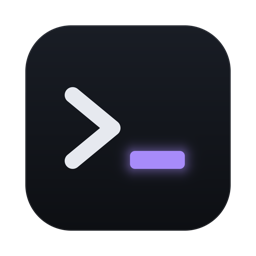

<div align="center">
  
  <h3><b>agentos</b></h3>
  <p>One desktop window for every coding-agent session you run</p>
  <p>
    <a href="https://github.com/nednella/agentos/releases/latest"></a>
    
  </p>
</div>

<br>


<br>

## Install

Needs macOS on Apple silicon, plus:

- [tmux](https://github.com/tmux/tmux): `brew install tmux`
- [GitHub CLI](https://cli.github.com), logged in: `brew install gh && gh auth login`; 2.99 or later to attach pictures when a note becomes an issue
- [Claude Code](https://docs.claude.com/en/docs/claude-code)
- optional: Brave, Chrome, Chromium or Edge, for the agent browser

```sh
curl -fsSL https://raw.githubusercontent.com/nednella/agentos/main/install.sh | bash
```

The script puts `agentos.app` in `~/Applications` and the `agentos` command in `~/.local/bin`, then lists anything missing. No sudo.

## Start

1. Open `agentos`.
2. Add a project: `⌘P` → _Add project_, or `agentos project add` in its folder.
3. Start a session: `⌘N`, or `Enter` on an issue in the queue to open it, then start one from it.

`⌘K` opens the command palette. `⌘/` lists every shortcut. `agentos --help` lists the commands.

## Set up a project

A project with no queue sections shows _Set up this project for agentos_ at the top of its queue.

- **Set up** adds an Inbox whose _Work_ action runs `/work <n>`, plus branch, clean-up and PR commands. If accepted, a session is started that writes the `/work` command, the issue template and `AGENTS.md` with you.
- **Not now** hides the offer. `⌘K` → _Set up project_ still works.

To change the config by hand, edit `~/.config/agentos/config.yaml`; the app picks the change up while it runs. `docs/config.md` describes every key.

## Update

Click `Update` in the top bar, or run `agentos update`. Sessions keep running.
