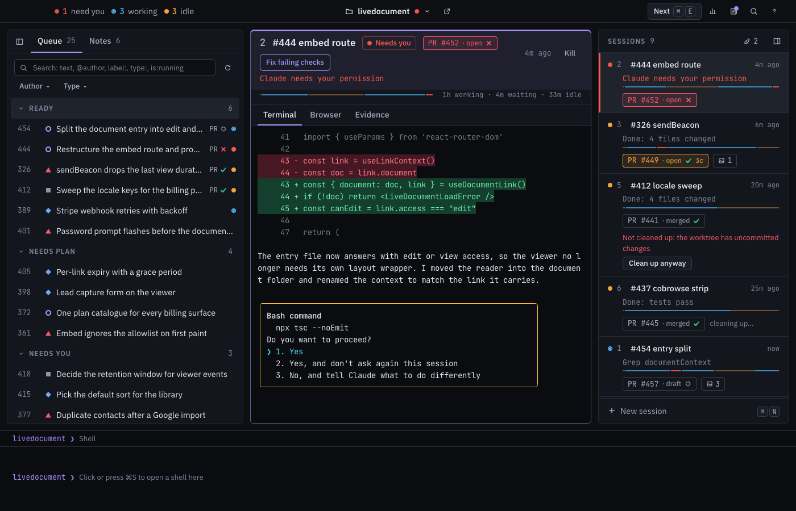

# agentos

One desktop window for every coding-agent session you run. It shows which session needs you, your
project's GitHub issues as a queue, your notes, and each agent's real terminal. Agents keep running
in a hidden tmux when the window closes.



## Install

You need macOS on Apple silicon, plus:

- [tmux](https://github.com/tmux/tmux): `brew install tmux`
- [GitHub CLI](https://cli.github.com), logged in: `brew install gh && gh auth login`
- [Claude Code](https://docs.claude.com/en/docs/claude-code)
- optional: a Chromium browser (Brave, Chrome, Chromium or Edge) for the agent browser

```sh
curl -fsSL https://raw.githubusercontent.com/nednella/agentos/main/install.sh | bash
```

This downloads the latest release, checks its sha256, puts `agentos.app` in `~/Applications`, links
the `agentos` command into `~/.local/bin` and tells you what is missing. No sudo.

The app checks for updates when it starts and every hour; click `Update` in the top bar, or run
`agentos update`. Your sessions live in tmux and survive.

## Use

Open `agentos`, add a project folder with `⌘P` → *Add project* (or run `agentos project add` in the
folder), then press `⌘N` for a session or `Enter` on an issue to read it, then start a session from it.

Out of the box the queue is one list of open issues, and each issue has one action, *Start*, which
types `Work on issue #<n>: <title>` into a new session. To group the queue by label and choose what
each group offers, set `queue_sections` on the project, for example:

```yaml
queue_sections:
  - name: Inbox
    labels: []                  # issues with no labels
    actions:
      - {name: Plan, command: "/plan {n}", model: opus, effort: high}
      - {name: Work, command: "/work {n}"}
  - name: Ready
    labels: [ready]
    actions:
      - {name: Work, command: "/work {n}"}
```

agentos sets no model, effort or command of its own. `docs/contract.md` has the details.

A session's pull request that gets a review, a comment or failing checks flags its row. To also
send the agent a command, set `pr_review_command` or `pr_checks_command` on the project, for example
`pr_review_command: "/address-review {n}"`; `docs/contract.md` has the details.

When a session's pull request merges, the app removes the session. To also clean up git, set
`session_cleanup_command` on the project, for example
`session_cleanup_command: "git worktree remove {force} {worktree} && git branch -D {branch}"`. Without it,
branches and folders stay as they are.

`⌘K` opens the command palette and `⌘/` lists every shortcut. `agentos --help` lists the command.
`docs/contract.md` describes the config file at `~/.config/agentos/config.yaml` and every key.

## Develop

```sh
make desktop-app     # builds the front end and bin/agentos-dev.app
go test -race ./... && go vet ./...
```

Conventional commits drive the releases. `docs/testing.md` says how to check a change without
touching your live sessions.
